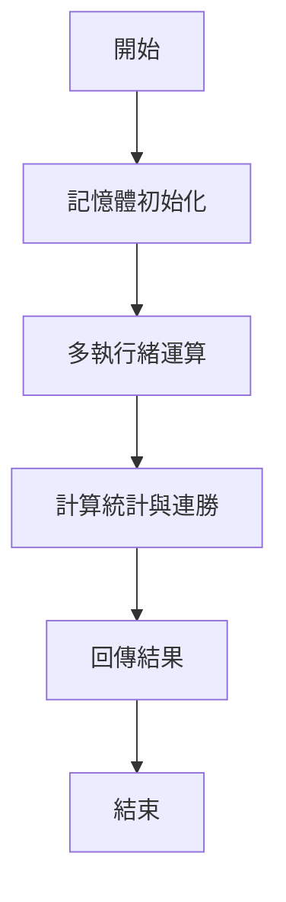
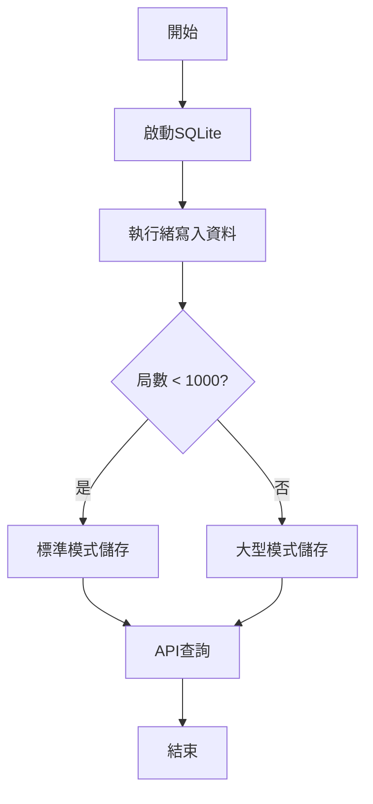
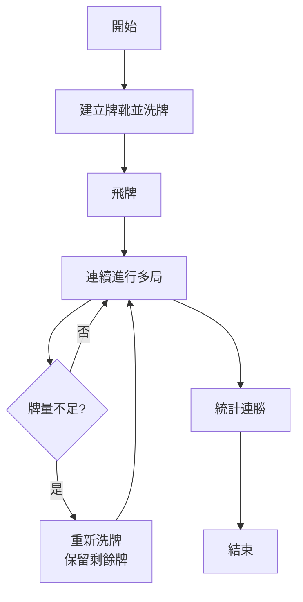
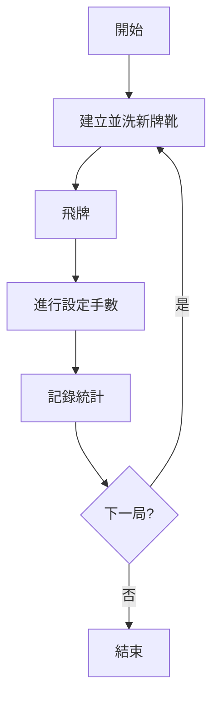

# 百家樂遊戲模擬器

一個高效能的**百家樂**賭場紙牌遊戲模擬器。本專案將所有遊戲邏輯移至後端服務，讓瀏覽器在執行大量遊戲時保持回應性。

## 百家樂遊戲規則介紹

### 遊戲目標
百家樂是一種比較紙牌遊戲，玩家需要預測「莊家」(Banker) 或「閒家」(Player) 哪一方的牌組總點數更接近 9 點，或者預測雙方會平手 (Tie)。

### 牌值計算
- **A**: 1點
- **2-9**: 按面值計算
- **10, J, Q, K**: 0點
- **總點數**: 所有牌值相加後取個位數 (例如：7+8=15，實際點數為5)

### 發牌規則
1. **初始發牌**: 莊家和閒家各發2張牌
2. **自然勝利**: 任一方前2張牌總和為8或9點，立即結束
3. **第三張牌規則**:
   - **閒家**: 總點數0-5時必須補牌，6-7點停牌
   - **莊家**: 根據自己的點數和閒家第三張牌決定是否補牌

### 莊家第三張牌詳細規則
- 莊家點數 ≤ 2: 必須補牌
- 莊家點數 = 3: 閒家第三張牌不是8時補牌
- 莊家點數 = 4: 閒家第三張牌是2,3,4,5,6,7時補牌
- 莊家點數 = 5: 閒家第三張牌是4,5,6,7時補牌
- 莊家點數 = 6: 閒家第三張牌是6,7時補牌
- 莊家點數 = 7: 停牌

### 對子投注
- **莊對**: 莊家前兩張牌相同
- **閒對**: 閒家前兩張牌相同

## 每手牌流程如下

### 1. 牌組準備
```
建立牌靴 (6-8副標準撲克牌) → 洗牌 → 飛牌 (跳過指定張數)
```

### 2. 初始發牌階段
```
第1張牌 → 閒家
第2張牌 → 莊家  
第3張牌 → 閒家
第4張牌 → 莊家
```

### 3. 點數計算
```
各自計算手牌總點數 (總和取個位數)
閒家點數 = (第1張 + 第3張) % 10
莊家點數 = (第2張 + 第4張) % 10
```

### 4. 自然勝利檢查
```
如果任一方點數 ≥ 8 → 立即結束，點數高者獲勝
```

### 5. 第三張牌規則 (若非自然勝利)

#### 閒家補牌規則
```
閒家點數 ≤ 5 → 必須補第三張牌
閒家點數 = 6或7 → 停牌
```

#### 莊家補牌規則 (複雜邏輯)
```
若閒家沒補牌:
  莊家點數 ≤ 5 → 補牌
  莊家點數 ≥ 6 → 停牌

若閒家有補牌 (根據閒家第三張牌值決定):
  莊家點數 ≤ 2 → 必須補牌
  莊家點數 = 3 → 閒家第三張非8時補牌
  莊家點數 = 4 → 閒家第三張是2,3,4,5,6,7時補牌
  莊家點數 = 5 → 閒家第三張是4,5,6,7時補牌  
  莊家點數 = 6 → 閒家第三張是6,7時補牌
  莊家點數 = 7 → 停牌
```

### 6. 最終判定
```
比較雙方最終點數 → 點數高者獲勝 → 相同則平手
同時檢查對子 → 記錄莊對/閒對發生次數
```

## 基本模擬流程

### 1. 參數設定階段
```
使用者設定:
├── SHOES數: 牌靴副數 (6-8副)
├── 運行: 模擬執行次數 (1-10次)  
├── 局數: 每次執行的遊戲局數 (1-100,000局)
├── 手: 每局遊戲的手數 (1-70手)
├── 飛牌數: 開始前跳過的牌數 (0-10張)
└── 模式: 超快記憶體 vs 資料庫儲存
```

### 2. 系統初始化
```
生成模擬ID → 選擇優化級別 → 初始化資料庫(若需要)
│
├── 總局數 < 1,000 → 標準模式 (完整資料儲存)
├── 總局數 ≥ 1,000 → 大型模式 (僅儲存摘要)  
└── 記憶體模式 → 超快模式 (純記憶體運算)
```

### 3. 工作分配階段
```
計算系統CPU核心數 → 將總工作量平均分配給多個執行緒
│
例如: 8核心系統處理8000局
├── 執行緒1: 處理第1-1000局
├── 執行緒2: 處理第1001-2000局
├── ...
└── 執行緒8: 處理第7001-8000局
```

### 4. 並行遊戲處理
```
每個執行緒獨立處理分配的遊戲:
│
For 每一局遊戲:
│  ├── 建立並洗亂牌組
│  ├── 執行飛牌操作  
│  │
│  For 每一手牌 (1到指定手數):
│  │  ├── 檢查剩餘牌數 (< 20張時重新洗牌)
│  │  ├── 執行上述「每手牌流程」
│  │  ├── 記錄結果 (莊/閒/和)
│  │  └── 統計對子次數
│  │
│  └── 彙總本局統計資料
│
回傳: 局次摘要 + 連勝分析數據
```

### 5. 數據處理模式

#### ⚡ 超快記憶體模式
```
工作者執行緒 → 純記憶體運算 → 預先計算所有統計
│                              │
└── 無資料庫寫入 ────────────────┘
│
結果: 最快速度，適合大量測試
```

#### 🚀 大型優化模式  
```
工作者執行緒 → 預先計算連勝分析 → 僅儲存遊戲摘要
│                                  │
└── 跳過個別手牌儲存 ──────────────┘
│  
結果: 高速度，節省儲存空間
```

#### 🔧 標準模式
```
工作者執行緒 → 完整資料處理 → 儲存所有手牌詳情
│                           │
└── 支援詳細查詢 ───────────┘
│
結果: 完整功能，適合深度分析
```

### 6. 結果彙總與展示
```
所有執行緒完成 → 主程序彙總結果 → 計算效能指標
│                              │
├── 執行時間統計               │
├── 處理速度 (手/秒)          │  
├── 連勝次數分析              │
├── 勝率統計                  │
└── 對子出現頻率              │
                               │
                               ▼
                        前端即時顯示:
                        ├── 互動式圖表
                        ├── 詳細數據表格  
                        ├── 大路/珠盤路圖
                        └── 效能指標顯示
```

### 7. 數據查詢與分析
```
使用者點擊局次卡片 → 載入該局詳細數據
│
├── 超快模式: 從記憶體快取載入
├── 其他模式: 從資料庫查詢載入
│
顯示:
├── 局次統計表格 (勝率、對子頻率)
├── 連續開莊/閒分析圖表
├── 個別遊戲詳情 (手牌記錄)
└── 大路珠盤路視覺化
```

## 專案特色

### 🚀 多重效能優化模式
1. **⚡ 超快記憶體模式**: 純記憶體運算，無資料庫操作，達到最大速度
2. **🚀 大型優化模式**: 適用於萬局以上模擬，預先計算連勝分析
3. **🔧 標準模式**: 完整資料庫儲存，支援詳細數據查詢

### 📊 智能數據分析
- 連續開莊/閒次數統計
- 大路、珠盤路圖表顯示
- 即時效能監控 (執行時間、每秒手數)
- 飛牌功能模擬真實賭場環境

### 💻 現代化架構
- React 前端使用 Ant Design 組件
- Node.js 後端多執行緒處理
- 臨時 SQLite 資料庫，重啟自動清理
- Electron 支援桌面應用

### 🎯 高效能設計
- 支援數萬局遊戲模擬而不當機
- 即時進度追蹤
- 大數據集分頁載入
- 記憶體使用優化

## 系統架構
```
前端 (React) ──► API ──► Node.js 後端 ──► SQLite (臨時)
                   │
                   └──► 多執行緒工作者 ──► 平行處理
```

這種架構避免記憶體崩潰，即使在重負載下也能保持 UI 回應性。

## 系統需求
- Node.js 16+
- npm 或 yarn
- SQLite3

## 安裝說明

### 後端安裝
```bash
cd server
npm install

# 大記憶體模式 (處理大型模擬)
npm install --production
```

### 前端安裝
```bash
cd client
npm install
```

## 使用方法

### 啟動後端服務
```bash
cd server
npm start
# 一般模式：http://localhost:3001

npm run start:large
# 大記憶體模式 (適合10萬局以上模擬)
```

### 啟動前端介面
```bash
cd client
npm start
# 網址：http://localhost:3000
```

### 模擬設定說明

#### 基本參數
- **SHOES數**: 牌靴張數 (6-8副牌)
- **運行**: 模擬執行次數 (1-10次)
- **局數**: 每次執行的遊戲局數 (1-100,000局)
- **手**: 每局遊戲的手數 (1-70手)
- **飛牌數**: 開始前跳過的牌數 (0-10張)

#### 模式選擇
- **儲存模式**
  - **⚡ 超快記憶體模式**: 純記憶體運算，速度最快，不寫入資料庫，適合大量測試
  - **💾 資料庫模式**: 完整資料儲存，支援詳細查詢，適合需要長期保存紀錄
- **遊戲模式**
  - **🔗 連貫模式**: 同一副牌靴連續進行多局遊戲
  - **🎯 標準模式**: 每局使用新的牌靴並限制手數

### 模式運作步驟

#### ⚡ 超快記憶體模式（儲存模式）
1. 在記憶體中初始化所有模擬資料
2. 以多執行緒快速運算，不進行任何資料庫 I/O
3. 完成後一次性計算統計與連勝結果
4. 將摘要資料回傳前端，模擬即告結束



#### 💾 資料庫模式（儲存模式）
1. 啟動 SQLite 資料庫並建立模擬紀錄
2. 每個工作執行緒結束後將結果寫入資料庫
3. 依總局數自動選擇標準或大型（MEGA）優化方式存放資料
4. 模擬完成後可透過 API 逐步載入局、遊戲與手牌細節



#### 🔗 連貫模式（遊戲模式）
1. 每個 play 建立一副牌靴並洗牌
2. 飛牌後所有遊戲共用同一副牌，牌量不足時重新洗牌並保留剩餘牌
3. 連續進行多局，統計資料以整個 play 為單位計算
4. 回傳包含跨局連勝分析的結果



#### 🎯 標準模式（遊戲模式）
1. 每局開始時重新建立並洗一副新的牌靴
2. 飛牌後按照設定的手數進行，局與局之間互不影響
3. 個別記錄莊、閒、和及對子等統計資料
4. 適合比較不同局的獨立結果，可對每局進行連勝分析



### 操作流程
1. 設定模擬參數
2. 選擇運行模式
3. 點擊**運行**開始模擬
4. 觀察即時進度和效能指標
5. 點擊完成的局次卡片查看詳細結果
6. 分析連勝統計和路圖

## API 文檔

### 模擬管理
- `POST /api/simulations` – 開始新的模擬
- `GET /api/simulations/{id}/status` – 檢查進度
- `GET /api/simulations/{id}/results` – 取得結果摘要
- `GET /api/simulations/{id}/plays` – 取得局次摘要

### 詳細數據
- `GET /api/simulations/{id}/plays/{playNumber}/games` – 取得指定局次的遊戲詳情
- `GET /api/games/{gameId}/hands` – 取得指定遊戲的手牌詳情
- `GET /api/simulations/{id}/plays/{playNumber}/consecutive-analysis` – 連勝分析

### 健康檢查
- `GET /api/health` – 服務狀態檢查

## 效能優化說明

### 超快記憶體模式 (Ultra-Fast)
- 🚀 純記憶體運算，不寫入資料庫
- ⚡ 預先計算所有統計數據
- 💾 零磁碟 I/O 操作
- 適用於：快速驗證、大量測試

### 大型優化模式 (Mega)
- 🚀 跳過個別手牌儲存
- 📊 預先計算連勝分析
- 💾 僅儲存遊戲摘要
- 適用於：萬局以上大型模擬

### 標準模式 (Standard)
- 🔧 完整資料儲存
- 📊 支援詳細查詢
- 💾 所有手牌記錄保存
- 適用於：詳細分析需求

## 故障排除

### 常見問題
1. **記憶體不足**
   - 使用超快記憶體模式
   - 減少模擬規模
   - 啟動大記憶體模式：`npm run start:large`

2. **資料庫鎖定**
   - 重啟後端服務
   - 臨時資料庫會自動清理

3. **前端無回應**
   - 確認後端服務運行在 3001 埠
   - 檢查瀏覽器控制台錯誤

4. **模擬速度慢**
   - 啟用超快記憶體模式
   - 減少飛牌數設定
   - 使用多核心模式

### 效能建議
- **小型測試** (< 1,000局): 任何模式
- **中型分析** (1,000-10,000局): 標準或大型模式  
- **大型研究** (> 10,000局): 超快記憶體模式
- **超大型** (> 100,000局): 超快模式 + 大記憶體啟動

## 開發貢獻

1. Fork 此專案
2. 建立功能分支 (`git checkout -b feature/新功能`)
3. 提交變更 (`git commit -am '新增某功能'`)
4. 推送到分支 (`git push origin feature/新功能`)
5. 建立 Pull Request

## 技術架構詳情

### 前端技術棧
- **React 18**: 現代化使用者介面
- **Ant Design**: 企業級 UI 組件
- **Chart.js**: 數據視覺化
- **WebSocket**: 即時進度更新

### 後端技術棧
- **Node.js**: 高效能 JavaScript 運行環境
- **Express.js**: 輕量級 Web 框架
- **Worker Threads**: 多執行緒並行處理
- **SQLite**: 嵌入式資料庫

### 核心演算法
- **蒙地卡羅模擬**: 隨機抽樣統計分析
- **大路演算法**: 百家樂經典路圖生成
- **記憶體池管理**: 大數據集高效處理
- **並行運算**: 多核心 CPU 充分利用

## 許可證
MIT License

---

**注意**: 本模擬器僅供學術研究和娛樂用途，不鼓勵實際賭博行為。請理性對待遊戲模擬結果。
